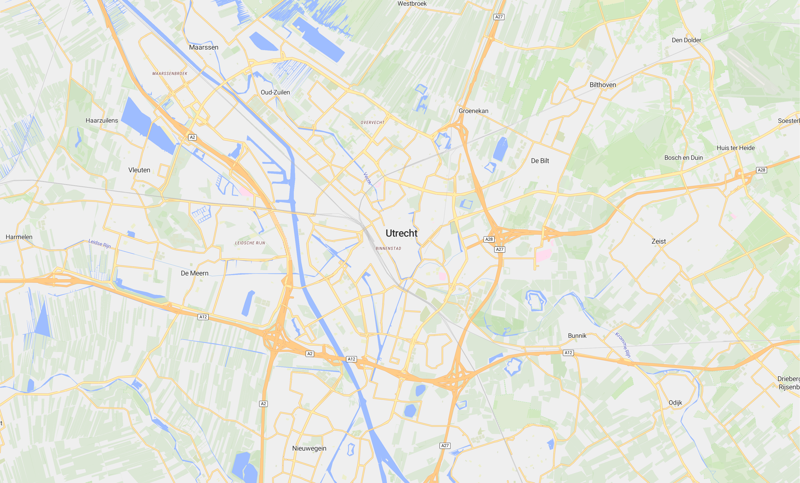

# Map Renderer

A ready-to-go 3D opengl map renderer using [tilemaker](https://github.com/systemed/tilemaker) and [maplibre](https://github.com/maplibre/maplibre-gl-js) with [pmtiles](https://docs.protomaps.com/pmtiles/maplibre) and the [osm-liberty](https://github.com/maputnik/osm-liberty) theme.

## Table of Contents

- [Map Renderer](#map-renderer)
  - [Table of Contents](#table-of-contents)
  - [Screenshots](#screenshots)
  - [Setup](#setup)
  - [Running](#running)

## Screenshots




## Setup

**1. Download the tilemaker executable, a map file and the required areas/polygons:**

| Source                                                                                                      | Target Location                                           |
| ----------------------------------------------------------------------------------------------------------- | --------------------------------------------------------- |
| [Tilemaker Executable](https://github.com/systemed/tilemaker/releases)                                      | `tilemaker/tilemaker`                                     |
| [Planet OSM](https://planet.openstreetmap.org/pbf/planet-latest.osm.pbf)                                    | `tilemaker/planet.osm.pbf`                                |
| [Water Polygons](https://osmdata.openstreetmap.de/download/water-polygons-split-4326.zip)                   | `tilemaker/coastline/`                                    |
| [Urban Areas](https://naciscdn.org/naturalearth/10m/cultural/ne_10m_urban_areas.zip)                        | `tilemaker/landcover/ne_10m_urban_areas/`                 |
| [Antarctic Polygons](https://naciscdn.org/naturalearth/10m/physical/ne_10m_antarctic_ice_shelves_polys.zip) | `tilemaker/landcover/ne_10m_antarctic_ice_shelves_polys/` |
| [Glaciated Areas](https://naciscdn.org/naturalearth/10m/physical/ne_10m_glaciated_areas.zip)                | `tilemaker/landcover/ne_10m_glaciated_areas/`             |

**2. Generate the tiles:**

```sh
# move to the tilemaker/ directory
cd tilemaker
# mark tilemaker as executable
chmod +x tilemaker
# run tilemaker, placing the result in the data directory
# (this takes a lot of memory)
./tilemaker planet.osm.pbf --output ../data/map.pmtiles
```

**3. Download the font and sprite files:**

| Source                                                                                                                      | Target Location |
| --------------------------------------------------------------------------------------------------------------------------- | --------------- |
| [OpenMapTiles Fonts](https://github.com/openmaptiles/fonts/releases/download/v2.0/v2.0.zip)                                 | `data/fonts/`   |
| [OSM Liberty Sprites](https://github.com/maputnik/osm-liberty/tree/gh-pages/sprites) **(ALREADY DOWNLOADED AND INCLUDED!)** | `data/sprites/` |

_For our configuration, only the Roboto fonts are required. The rest can be omitted._

## Running

- To run and view the map in _development_, use a dev server like [live server](https://www.npmjs.com/package/live-server).
- To serve everything in _production_, use a http server like [nginx](https://nginx.org/).
